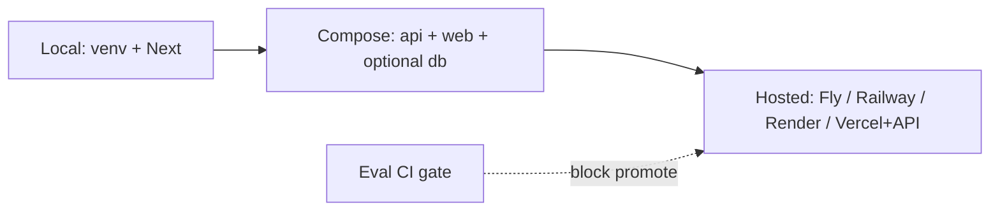
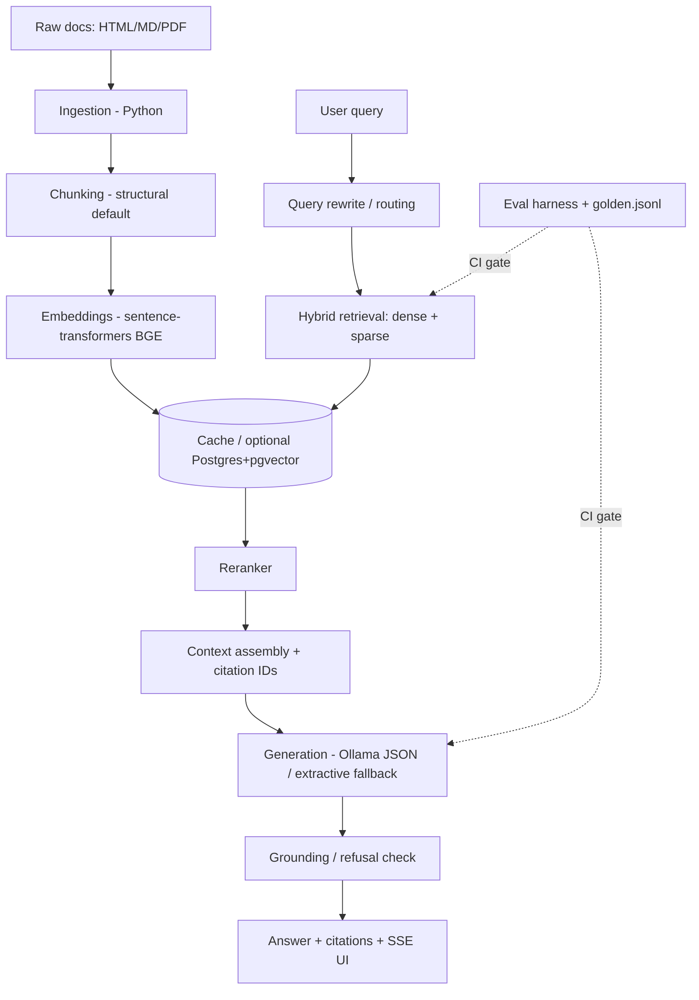

# ContextIQ Architecture

> Status: **Free local stack** — Next.js + Python RAG + sentence-transformers + Ollama. AWS optional, not required.

## One-line pitch

**ContextIQ** is an **eval-first RAG platform for production knowledge and support systems** — hybrid retrieval, grounded citations, refusal when ungrounded, and a CI-gated quality bar — runnable **fully offline / free**.

The demo corpus includes public **Next.js + FastAPI** docs plus some **AWS Lambda / Bedrock / SST** pages for golden-set continuity. The *product* is knowledge/support intelligence; the *runtime* does not require AWS.

## Stack (portfolio default)

| Layer | Choice | Cost |
|---|---|---|
| Frontend | Next.js + TypeScript + Tailwind | Free |
| API | Starlette SSE (`contextiq-serve`) → FastAPI-ready | Free |
| RAG | Python (`packages/ingestion`) | Free |
| Embeddings | `sentence-transformers` BGE-small (384-d) | Free |
| LLM | Ollama (`llama3.2:1b`) · extractive fallback | Free |
| DB | Postgres + pgvector (optional Docker) | Free |
| Eval | First-party metrics + CI gate | Free |
| Deploy | Local → Compose → Hosted (see runbook) | Free → your host |

AWS Bedrock / Lambda / SST are **optional later** — not part of the default path.

## Deployment stages



| Stage | How | Docs |
|-------|-----|------|
| Local | `contextiq-serve` + `npm run dev` | [SETUP-FREE](SETUP-FREE.md) |
| Compose | `docker compose -f infra/docker-compose.yml up --build` | [runbook](runbook-production.md) · `infra/` |
| Hosted | Operator account + secrets + HTTPS | [runbook](runbook-production.md) · [ADR 019](decisions/019-deploy-path.md) |

Bake `corpus/embeddings` before Compose/hosted — not committed to git.

## Why this architecture (not another chatbot)
| Tutorial RAG | ContextIQ |
|---|---|
| Build retrieval first, eyeball quality later | Golden eval set **before** retrieval code |
| Pure vector search | Hybrid dense + keyword → RRF → rerank |
| Answer without sources | Structured citations + refusal path |
| "Seems good" | Context Precision / Recall, Faithfulness, Refusal Accuracy |
| No regression story | Eval suite in CI with fail thresholds |

## Target pipeline



## Repo layout

```
RAG_system/
├── apps/web/                 # Next.js chat, eval, traces
├── packages/ingestion/       # Python ingest → retrieve → generate → eval
├── infra/                    # docker-compose: api + web + optional Postgres
├── corpus/                   # sources catalog (+ gitignored raw/clean/chunks/embeddings)
├── eval/                     # golden.jsonl + CI baseline/thresholds
├── docs/                     # architecture, ADRs, eval results, writing, deploy
└── .github/workflows/        # ci.yml + eval.yml + deploy.yml
```

## Corpus

Public docs: **Next.js + FastAPI** (primary) and **AWS Lambda / Bedrock / SST** pages kept for golden-set continuity — the *docs* are about AWS; the *runtime* does not need AWS.

## Defaults

```bash
CONTEXTIQ_EMBEDDING_PROVIDER=sbert   # BAAI/bge-small-en-v1.5
CONTEXTIQ_GENERATOR=ollama           # falls back to extractive if Ollama is down
```

See [ADR 010](./decisions/010-free-local-stack.md) · [ADR 019](./decisions/019-deploy-path.md) · [runbook](./runbook-production.md) · [roadmap](./ROADMAP.md).
